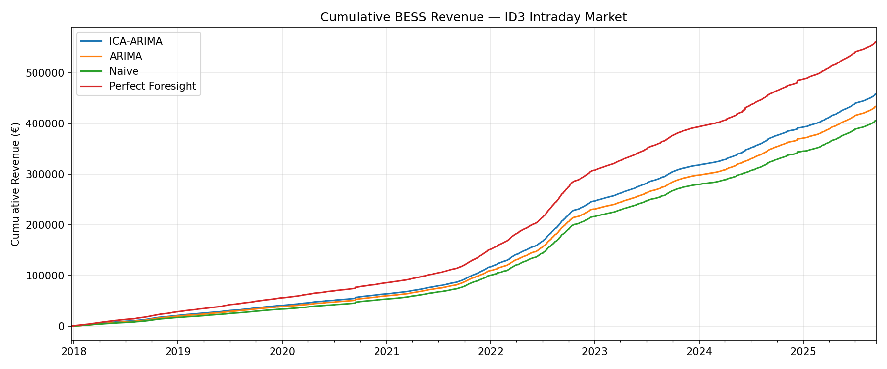
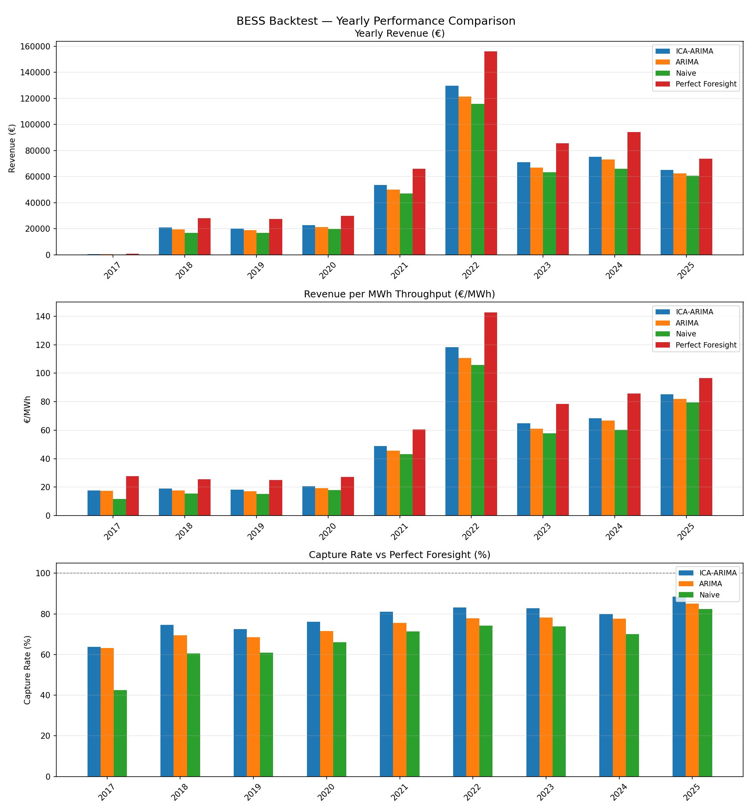

# ICA-ARIMA Price Forecasting & BESS Optimisation

A pipeline for ID3 electricity price index forecasting and battery energy storage system (BESS) dispatch optimisation on EPEX Spot (2018–2025).

The project demonstrates the full workflow from raw market data to trading strategy evaluation:
data preprocessing → signal decomposition → time-series forecasting → LP optimisation → backtesting.

## Pipeline

```
Raw EPEX ID3 prices (hourly, CSV)
        │
        ▼
  preprocess_id3_data.py
  Pivot to (date × hour) matrix
        │
        ▼
  historical_ica_arima_id3.py          historical_arima_id3.py
  Rolling 365-day window:              Rolling 356-day window:
  1. StandardScaler                    Per-hour AutoARIMA
  2. FastICA (24 components)           → arima_predictions.csv
  3. AutoARIMA on each component
  4. Inverse ICA + inverse scaler
  → predictions.csv                   (Naive baseline: yesterday's prices)
        │
        ▼
  bess_backtest.py / bess_backtest.ipynb
  LP optimisation (Pyomo / GLPK) per day
  • Schedule derived from predicted prices
  • Revenue evaluated at actual prices
  → Comparative backtesting across all strategies
```

---

## Methods

### Price Forecasting

| Model     | Description                                                                                                                                                                                        |
| --------- | -------------------------------------------------------------------------------------------------------------------------------------------------------------------------------------------------- |
| ICA-ARIMA | FastICA decomposes the 24-h price vector into independent sources; AutoARIMA predicts each source one step ahead; inverse transform reconstructs next-day prices. Rolling 365-day training window. |
| ARIMA     | Independent AutoARIMA for each of the 24 hours. Rolling 356-day window. Baseline univariate benchmark.                                                                                             |
| Naive     | Yesterday's price profile as the forecast. Zero-parameter benchmark.                                                                                                                               |

### BESS Optimisation

A Linear Programme (LP) determines the optimal charge/discharge schedule for a battery with the following spec:

| Parameter      | Value                                 |
| -------------- | ------------------------------------- |
| Capacity       | 2 MWh                                 |
| Power          | 1 MW                                  |
| Max cycles/day | 1.5                                   |
| Initial SoC    | 0 MWh                                 |
| End SoC        | = Initial SoC (round-trip constraint) |

The objective is to maximise `Σ schedule[t] × price[t]` subject to SoC bounds, power limits, and the cycle constraint. Predictions are used to determine the schedule; revenue is evaluated at actual realised prices, correctly simulating the information asymmetry of live trading.

Perfect Foresight (benchmark) uses actual prices as input to the LP, giving an upper bound on achievable revenue.

---

## Results

### Backtest Summary (2018–2025, 1 MW / 2 MWh BESS)

| Strategy          | Total Revenue (€) | Avg Daily (€) | €/MWh | Capture Rate |
| ----------------- | ------------------ | -------------- | ------ | ------------ |
| ICA-ARIMA         | 458,256            | 162.50         | 54.18  | 81.6%        |
| ARIMA             | 433,957            | 153.89         | 51.30  | 77.3%        |
| Naive             | 406,242            | 144.06         | 48.07  | 72.4%        |
| Perfect Foresight | 561,271            | 199.03         | 66.41  | 100.0%       |

€/MWh = revenue per MWh discharged (size-agnostic profitability).
Capture Rate = revenue as a fraction of perfect-foresight; measures how much of the theoretically achievable profit the forecast recovers.

### Plots





---

### Key Design Choices

- Rolling window refit: both ICA and ARIMA models are refit every day on the trailing year of data. This prevents look-ahead bias and adapts to regime changes (e.g., the 2021–2022 energy crisis).
- Latent-space forecasting: ICA is fit on the full 24-h price vector rather than per-hour, capturing cross-hour structure (price spikes, morning/evening ramps) that per-hour models miss.
- LP over heuristics: the dispatch optimiser is an exact LP rather than a rule-based heuristic, ensuring the schedule is globally optimal given the input price forecast.
- Correct information structure: schedules are computed from predicted prices; revenues are computed from actual prices. This is the critical separation that makes the backtest realistic.
